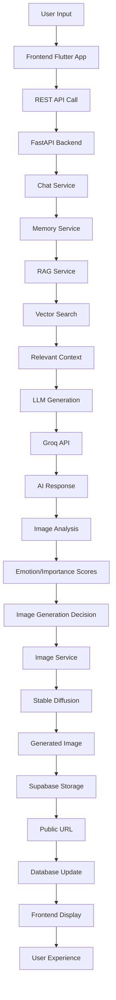
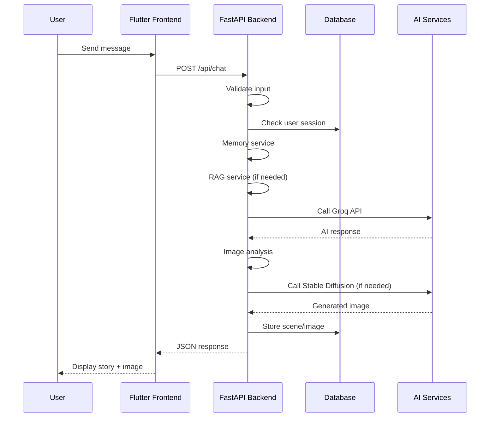
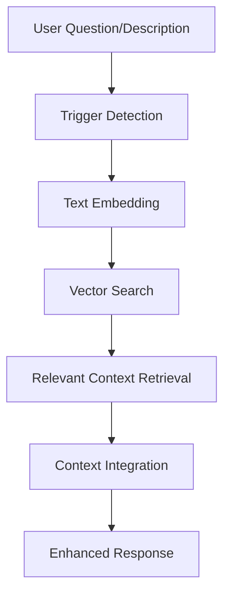
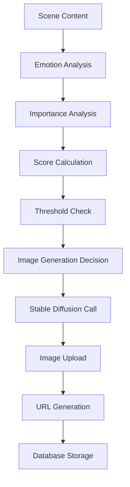
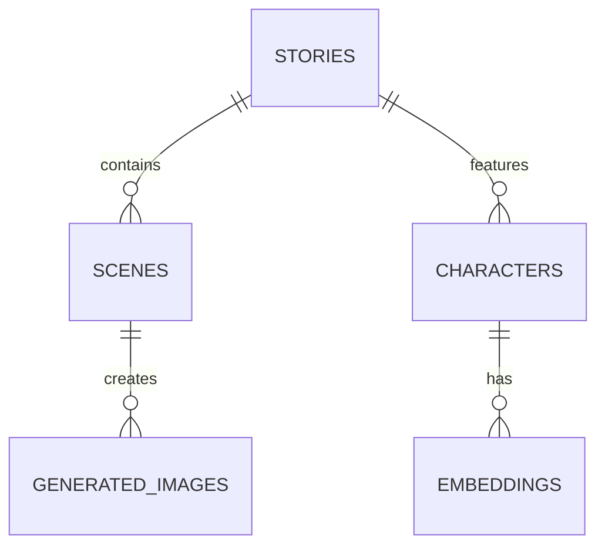

# 📖 NovelAIne Pipeline Documentation

> **AI-Powered Interactive Storytelling Platform**
> Comprehensive visualization of the NovelAIne system pipeline

---

## 📊 Project Overview

**NovelAIne** is an AI-powered interactive storytelling platform that combines intelligent context management, RAG-based memory systems, and automated scene visualization to create immersive narrative experiences.

### Core Features
- **Intelligent Context Management**: Summary buffer memory for seamless narrative flow
- **RAG-based Memory**: Vector database for retrieving relevant character and story information
- **Scene Visualization**: Automatic image generation for emotionally significant moments
- **Interactive Storytelling**: User-driven narrative progression with AI responses

---

## 🛠 Tech Stack Visualization

```
┌────────────────────────────────────────────────────────────────────────┐
│                    Frontend (Flutter)                     │
│  Dart + Flutter + Interactive UI Components                │
│  • Story creation and management                           │
│  • Real-time chat interface                                │
│  • Image display and BGM integration                       │
└────────────────────────────────────────────────────────────────────────┘
                              ▲
                              │
┌────────────────────────────────────────────────────────────────────────┐
│                  Backend (FastAPI)                         │
│  Python 3.12 + FastAPI + Pydantic + Groq                   │
│  • REST API endpoints                                     │
│  • AI integration services                                │
│  • Database operations                                    │
└────────────────────────────────────────────────────────────────────────┘
                              ▲
                              │
┌────────────────────────────────────────────────────────────────────────┐
│                      Database (Supabase)                    │
│  PostgreSQL + pgvector + Storage                          │
│  • Stories, Scenes, Characters tables                     │
│  • Vector embeddings for RAG                              │
│  • Image storage in Storage                               │
└────────────────────────────────────────────────────────────────────────┘
                              ▲
                              │
┌────────────────────────────────────────────────────────────────────────┐
│                        AI Services                          │
│  Groq API (Llama 3.3 70B) + Stable Diffusion               │
│  • Story generation                                       │
│  • Context-aware responses                                │
│  • Scene image generation                                 │
└────────────────────────────────────────────────────────────────────────┘
```

---

## 🏗 Architecture Flow

### Complete Pipeline Flow



### Step-by-Step Process

1. **User Interaction**
   - User types message or makes choice in Flutter app
   - Request sent to FastAPI backend

2. **Context Management**
   - Memory service buffers recent conversation (last 10 turns)
   - System prompt combines with user context

3. **RAG Processing**
   - RAG service triggered by questions or long inputs
   - Vector search retrieves relevant character/story information
   - Context embedded in system prompt

4. **AI Generation**
   - Chat service calls Groq API with complete prompt
   - LLM generates story continuation
   - Response includes emotion/importance scores

5. **Image Generation**
   - Scene content analyzed for emotional intensity
   - If scores exceed thresholds, image generation triggered
   - Stable Diffusion creates scene illustration
   - Image uploaded to Supabase Storage

6. **Database Update**
   - Scene, image metadata stored in database
   - Relationships maintained between entities
   - Public URLs generated for frontend access

7. **Frontend Display**
   - Updated story content displayed
   - Generated images shown at appropriate moments
   - BGM integration (future feature)

---

## 📊 Data Flow Diagrams

### User Request Flow



### Database Interaction Flow


---

## 🎯 Key Features Flow

### RAG System Flow



**Trigger Conditions:**
- Questions containing "누구", "왜", "어떤", "?"
- Long inputs (>20 characters)
- Context-specific queries

### Image Generation Flow



**Scoring Criteria:**
- **Emotion Score**: Keywords like "death", "love", "betrayal", "victory"
- **Importance Score**: Keywords like "choice", "decision", "discovery"
- **Threshold**: Generate if emotion > 0.5 OR importance > 0.6

---

## 🔌 API Endpoints

### Main API Routes

```
POST   /api/chat              # AI chat with context management
GET    /api/stories          # List user stories
POST   /api/stories          # Create new story
GET    /api/stories/:id      # Get story details
PATCH  /api/stories/:id      # Update story
DELETE /api/stories/:id      # Delete story

POST   /api/stories/:id/scenes  # Add scene (triggers image gen)
GET    /api/characters          # List characters
POST   /api/characters          # Create character (vectorized)
POST   /api/auth/login          # User authentication
```

### Chat Endpoint Details

**Request:**
```json
{
  "message": "주인공은 누구야?"
}
```

**Response:**
```json
{
  "response": "당신은 이 이야기의 주인공 '지연'입니다...",
  "emotion_score": 0.2,
  "importance_score": 0.8,
  "generated_image_url": "https://..."
}
```

---

## 🗄 Database Schema Overview

### Core Tables

```sql
-- Stories table
stories (
    id UUID PRIMARY KEY,
    title VARCHAR(200),
    genre VARCHAR(50),
    description TEXT,
    status VARCHAR(20),
    created_at TIMESTAMP,
    user_id UUID REFERENCES users
)

-- Scenes table  
scenes (
    id UUID PRIMARY KEY,
    story_id UUID REFERENCES stories,
    content TEXT,
    sequence INTEGER,
    emotion_score FLOAT,
    importance_score FLOAT,
    has_generated_image BOOLEAN,
    created_at TIMESTAMP
)

-- Characters table
characters (
    id UUID PRIMARY KEY,
    name VARCHAR(100),
    description TEXT,
    personality_traits JSONB,
    background_story TEXT,
    embedding FLOAT[] -- Vector for RAG
)

-- Generated images table
generated_images (
    id UUID PRIMARY KEY,
    scene_id UUID REFERENCES scenes,
    image_url VARCHAR(500),
    prompt_used TEXT,
    created_at TIMESTAMP
)
```

### Relationships



---

## 🚀 Development Workflow

### Backend Development

```bash
# Setup
cd backend
pip install -r requirements.txt
cp .env.example .env

# Run server
python main.py
# or
uvicorn main:app --reload

# Testing
pytest tests/
pytest tests/ --cov=. --cov-report=html
```

### Frontend Development

```bash
# Setup
cd frontend
flutter pub get

# Run app
flutter run

# Build
flutter build apk
flutter build web
```

### Database Operations

```bash
# Supabase CLI
supabase start
# Access at http://localhost:54323

# Migration
supabase db push
supabase db shell
```

### AI Integration Testing

```bash
# Test RAG
python test_rag.py

# Test image generation
python -c "from app.services.image_service import ImageService; ImageService().generate_scene_image('test prompt', 'test_scene')"
```

---

## 🎯 Performance Considerations

### Token Optimization
- **Summary Buffer**: Only last 10 turns kept verbatim
- **RAG Trigger**: Only called for questions/long inputs
- **Prompt Compression**: Keyword-focused prompt engineering

### Cost Management
- **Selective Image Generation**: Only for high-score scenes
- **Vector Search**: Reduces token usage vs full context
- **Efficient Models**: Groq API for high-speed inference

### Scalability
- **Async Operations**: Non-blocking image generation
- **Database Indexing**: Optimized vector searches
- **CDN Storage**: Fast image delivery

---

## 📋 Deployment Architecture


---

## 📊 Monitoring & Analytics

### Key Metrics
- **API Response Time**: Target < 2s
- **Image Generation Success**: Target > 95%
- **User Engagement**: Story completion rates
- **Cost per Story**: Token usage tracking

### Error Handling
- **Graceful Degradation**: Continue without RAG if failed
- **Fallback Content**: Default responses for AI errors
- **Retry Logic**: Automatic retries for transient failures

---

This comprehensive pipeline documentation provides a complete overview of NovelAIne's architecture, data flows, and development processes for both technical and non-technical stakeholders.