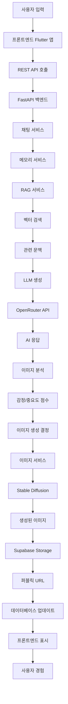
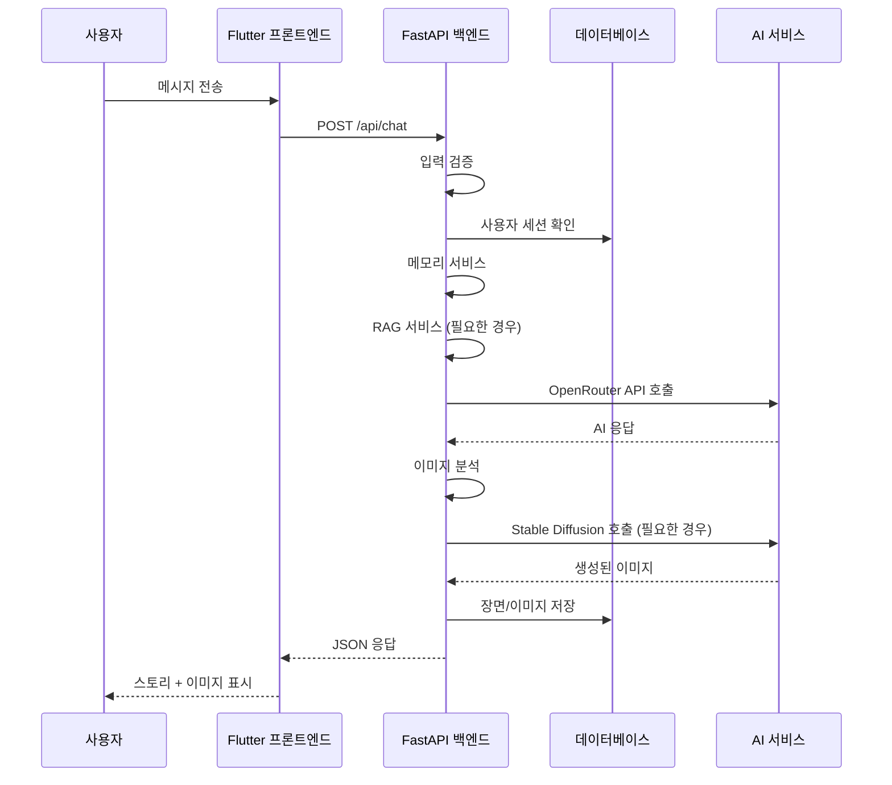
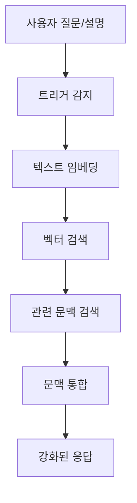
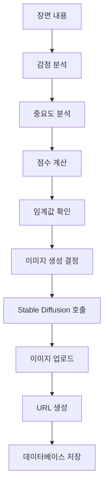
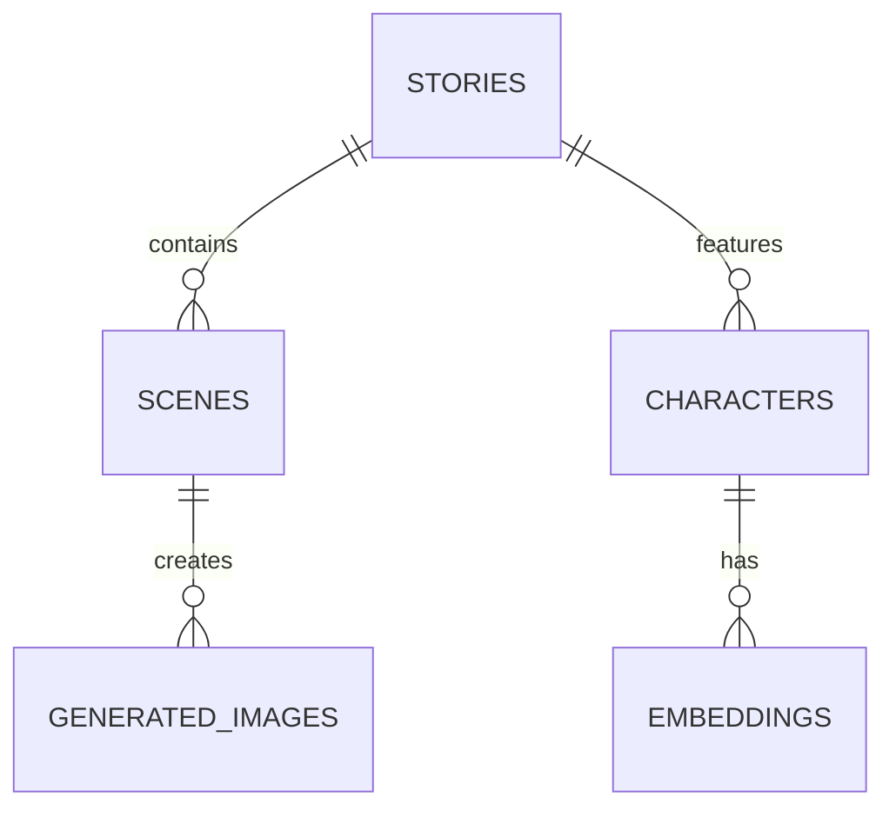
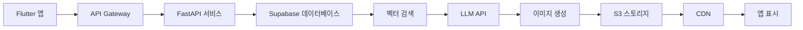

# 📖 NovelAIne 파이프라인 문서

> **AI 기반 인터랙티브 스토리텔링 플랫폼**
> NovelAIne 시스템 파이프라인의 종합적인 시각화

---

## 📊 프로젝트 개요

**NovelAIne**은 지능형 문맥 관리, RAG 기반 메모리 시스템 및 자동화된 장면 시각화를 결합하여 몰입감 있는 이야기 경험을 창출하는 AI 기반 인터랙티브 스토리텔링 플랫폼입니다.

### 핵심 기능
- **지능형 문맥 관리**: 매끄러운 이야기 흐름을 위한 요약 버퍼 메모리
- **RAG 기반 메모리**: 관련 캐릭터 및 스토리 정보를 검색하기 위한 벡터 데이터베이스
- **다이내믹 캐릭터 시스템**: 실시간 장면 분석을 통한 캐릭터 등장/퇴장 자동 관리
- **AI 엔진 이원화**: Gemini 2.0 Flash 및 1.5 Pro 모델 선택 및 실시간 전환 지원
- **고성능 렌더링**: Isolate 기반 사전 파싱 및 스트리밍 스로틀링을 통한 60fps 보장
- **장면 시각화**: 감정적으로 중요한 순간에 대한 자동 이미지 생성
- **인터랙티브 스토리텔링**: AI 응답과 함께하는 사용자 주도적 이야기 진행

---

## 🛠 기술 스택 시각화

```text
┌────────────────────────────────────────────────────────────────────────┐
│                        프론트엔드 (Flutter)                        │
│  Dart + Flutter + 대화형 UI 컴포넌트                               │
│  • 스토리 생성 및 관리                                             │
│  • 실시간 채팅 인터페이스                                          │
│  • 이미지 표시 및 BGM 연동                                         │
└────────────────────────────────────────────────────────────────────────┘
                               ▲
                               │
┌────────────────────────────────────────────────────────────────────────┐
│                        백엔드 (FastAPI)                            │
│  Python 3.12 + FastAPI + Pydantic + OpenRouter (Gemini)                           │
│  • REST API 엔드포인트                                            │
│  • AI 연동 서비스                                                 │
│  • 데이터베이스 작업                                               │
└────────────────────────────────────────────────────────────────────────┘
                               ▲
                               │
┌────────────────────────────────────────────────────────────────────────┐
│                      데이터베이스 (Supabase)                      │
│  PostgreSQL + pgvector + Storage                                   │
│  • 스토리, 장면, 캐릭터 테이블                                     │
│  • RAG용 벡터 임베딩                                              │
│  • Storage를 통한 이미지 저장                                      │
└────────────────────────────────────────────────────────────────────────┘
                               ▲
                               │
┌────────────────────────────────────────────────────────────────────────┐
│                           AI 서비스                                │
│  OpenRouter API (Gemini 2.0 Flash) + Stable Diffusion                       │
│  • 스토리 생성                                                     │
│  • 문맥 인식 응답                                                  │
│  • 장면 이미지 생성                                                │
└────────────────────────────────────────────────────────────────────────┘
```

---

## 🏗 아키텍처 흐름

### 전체 파이프라인 흐름



### 단계별 프로세스

1. **사용자 상호작용**
   - 사용자가 Flutter 앱에서 메시지를 입력하거나 선택 수행
   - FastAPI 백엔드로 요청 전송

2. **문맥 관리**
   - 메모리 서비스가 최근 대화를 버퍼링 (최근 10턴)
   - 시스템 프롬프트와 사용자 문맥 결합

3. **RAG 처리**
   - 질문이나 긴 입력 발생 시 RAG 서비스 트리거
   - 벡터 검색을 통해 관련 캐릭터/스토리 정보 검색
   - 시스템 프롬프트에 문맥 포함

4. **AI 생성**
   - 채팅 서비스가 완전한 프롬프트로 OpenRouter API 호출
   - LLM이 이야기의 다음 부분을 생성
   - 응답에 감정 및 중요도 점수 포함

5. **이미지 생성**
   - 장면 구성 요소의 감정적 강도 분석
   - 점수가 임계값을 초과하면 이미지 생성 트리거
   - Stable Diffusion을 사용하여 장면 일러스트 생성
   - Supabase Storage에 이미지 업로드

6. **데이터베이스 업데이트**
   - 장면 및 이미지 메타데이터를 데이터베이스에 저장
   - 엔티티 간의 관계 유지
   - 프론트엔드 접근을 위한 퍼블릭 URL 생성

7. **프론트엔드 표시**
   - 업데이트된 스토리 내용 표시
   - 적절한 순간에 생성된 이미지 노출
   - BGM 연동 (예정 기능)

---

## 📊 데이터 흐름도

### 사용자 요청 흐름



### 데이터베이스 상호작용 흐름


---

## 🎯 주요 기능 흐름

### RAG 시스템 흐름



**트리거 조건:**
- "누구", "왜", "어떤", "?"가 포함된 질문
- 긴 입력 (20자 초과)
- 문맥별 질의

### 이미지 생성 흐름



**채점 기준:**
- **감정 점수 (Emotion Score)**: "죽음", "사랑", "배신", "승리" 등과 같은 키워드
- **중요도 점수 (Importance Score)**: "선택", "결정", "발견" 등과 같은 키워드
- **임계값**: 감정 점수 > 0.5 또는 중요도 점수 > 0.6일 경우 생성

---

## 🔌 API 엔드포인트

### 주요 API 라우트

```
POST   /api/chat              # 문맥 관리를 갖춘 AI 채팅
POST   /api/chat/stream       # 실시간 스트리밍 AI 채팅
GET    /api/stories          # 사용자 스토리 목록 조회
POST   /api/stories          # 새 스토리 생성
GET    /api/stories/:id      # 스토리 상세 조회
PATCH  /api/stories/:id      # 스토리 업데이트 (AI 모델 포함)
DELETE /api/stories/:id      # 스토리 삭제

POST   /api/stories/:id/scenes/analyze  # 장면 분석 API
GET    /api/characters          # 캐릭터 목록 조회
POST   /api/characters          # 캐릭터 생성 (벡터화)
POST   /api/auth/login          # 사용자 인증
```

### 채팅 엔드포인트 상세

**요청 (Request):**
```json
{
  "message": "주인공은 누구야?"
}
```

**응답 (Response):**
```json
{
  "response": "당신은 이 이야기의 주인공 '지연'입니다...",
  "emotion_score": 0.2,
  "importance_score": 0.8,
  "generated_image_url": "https://..."
}
```

---

## 🗄 데이터베이스 스키마 개요

### 핵심 테이블

```sql
-- Stories (스토리) 테이블
stories (
    id UUID PRIMARY KEY,
    title VARCHAR(200),
    genre VARCHAR(50),
    description TEXT,
    status VARCHAR(20),
    created_at TIMESTAMP,
    user_id UUID REFERENCES users
)

-- Scenes (장면) 테이블  
scenes (
    id UUID PRIMARY KEY,
    story_id UUID REFERENCES stories,
    content TEXT,
    sequence INTEGER,
    emotion_score FLOAT,
    importance_score FLOAT,
    has_generated_image BOOLEAN,
    created_at TIMESTAMP
)

-- Characters (캐릭터) 테이블
characters (
    id UUID PRIMARY KEY,
    name VARCHAR(100),
    description TEXT,
    personality_traits JSONB,
    background_story TEXT,
    embedding FLOAT[] -- RAG용 벡터
)

-- Generated images (생성된 이미지) 테이블
generated_images (
    id UUID PRIMARY KEY,
    scene_id UUID REFERENCES scenes,
    image_url VARCHAR(500),
    prompt_used TEXT,
    created_at TIMESTAMP
)
```

### 관계도



---

## 🚀 개발 워크플로우

### 백엔드 개발

```bash
# 설정
cd backend
pip install -r requirements.txt
cp .env.example .env

# 서버 실행
python main.py
# 또는
uvicorn main:app --reload

# 테스트
pytest tests/
pytest tests/ --cov=. --cov-report=html
```

### 프론트엔드 개발

```bash
# 설정
cd frontend
flutter pub get

# 앱 실행
flutter run

# 빌드
flutter build apk
flutter build web
```

### 데이터베이스 운영

```bash
# Supabase CLI
supabase start
# http://localhost:54323 접속

# 마이그레이션
supabase db push
supabase db shell
```

### AI 연동 테스트

```bash
# RAG 테스트
python test_rag.py

# 이미지 생성 테스트
python -c "from app.services.image_service import ImageService; ImageService().generate_scene_image('test prompt', 'test_scene')"
```

---

## 🎯 성능 고려사항

### 토큰 최적화
- **요약 버퍼**: 마지막 10회의 턴만 그대로 유지
- **RAG 트리거**: 질문 또는 긴 입력에 대해서만 호출
- **프롬프트 압축**: 키워드 중심의 프롬프트 엔지니어링

### 비용 관리
- **선택적 이미지 생성**: 높은 점수의 장면에 대해서만 생성
- **벡터 검색**: 전체 문맥 사용 대비 토큰 사용량 감소

### 확장성
- **비동기 작업**: 논블로킹 이미지 생성
- **데이터베이스 인덱싱**: 최적화된 벡터 검색
- **CDN 스토리지**: 빠른 이미지 전송

---

## 📋 배포 아키텍처



---

## 📊 모니터링 및 분석

### 주요 지표
- **API 응답 시간**: 목표 < 2초
- **이미지 생성 성공률**: 목표 > 95%
- **사용자 참여도**: 스토리 완료율
- **스토리당 비용**: 토큰 사용량 추적

### 에러 처리
- **완만한 기능 저하(Graceful Degradation)**: RAG 실패 시 기본 챗으로 계속 진행
- **대체 콘텐츠**: AI 에러 시 기본 응답 제공
- **재시도 로직**: 일시적 실패 시 자동 재시도

---

이 종합적인 파이프라인 문서는 기술 및 비기술 이해관계자 모두를 위해 NovelAIne의 아키텍처, 데이터 흐름, 개발 프로세스에 대한 완전한 개요를 제공합니다.
